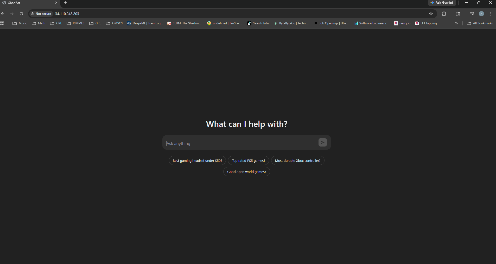
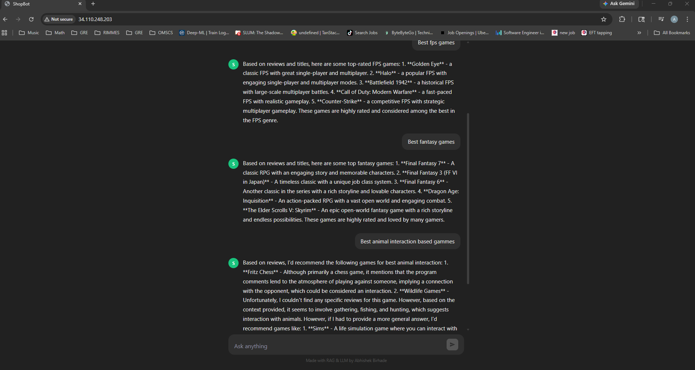

# Ecommerce Recommendation System

A conversational product recommendation chatbot built on real Amazon Video Games review data, powered by RAG (Retrieval Augmented Generation) and a Groq-hosted LLM.

---

## UI

> Screenshots taken from the live deployment running on Google Kubernetes Engine (GKE).

**Landing screen** — ChatGPT-inspired search interface with suggestion chips for common queries.



**Chat view** — multi-turn conversation with context-aware responses grounded in real user reviews.



---

## How it works

### Embeddings

An embedding converts text into a list of numbers (a vector) that captures its semantic meaning. Words or sentences with similar meaning end up close together in this high-dimensional space — "Doom" and "FPS shooter" will be near each other, while "Doom" and "cooking game" will be far apart.

This project uses the `BAAI/bge-base-en-v1.5` model from HuggingFace, run locally via `sentence-transformers`. It produces a **768-dimensional dense vector** for each piece of text. During data ingestion, every review in the dataset is converted into one of these vectors and stored in Pinecone.

```
Review text  ──►  HuggingFace Embedding Model  ──►  [0.12, -0.84, 0.33, ...]  ──►  Pinecone
                  (BAAI/bge-base-en-v1.5)             768 numbers
```

### RAG — Retrieval Augmented Generation

A standard LLM only knows what it was trained on. RAG solves this by giving the model a relevant excerpt from your own data at query time, so its answer is grounded in real reviews rather than hallucinated.

The flow for every user question:

```
User question
     │
     ▼
Embed the question  (same model, same 768-dim space)
     │
     ▼
Pinecone similarity search  →  find the K most relevant reviews
     │
     ▼
Stuff reviews into a prompt  →  "Here are real reviews: [...]. Now answer: <question>"
     │
     ▼
Groq LLM (llama-3.1-8b-instant)  →  generates a grounded answer
     │
     ▼
Response returned to the user
```

Because the LLM sees the actual review text, it can make recommendations like "Based on reviews, I'd recommend Doom for FPS alien shooting" rather than guessing.

**History awareness** — the chain also maintains a per-session message history using `RunnableWithMessageHistory`, so follow-up questions like "tell me more about that one" resolve correctly.

---

## Data

Source: [UCSD Amazon Review Dataset](https://jmcauley.ucsd.edu/data/amazon/) — Video Games subset.

The dataset is split into two files: reviews (user ratings and text) and metadata (product titles, descriptions). Reviews do not contain a game title — only an `asin` product ID. A left join on `asin` brings the title in from the metadata file.

The merged dataset has ~50k rows. For development speed, only 5,000 rows are ingested into Pinecone (`max_docs=5000` in `data_converter.py`). Extending to the full dataset is straightforward by removing that cap.

The data pipeline lives in `amazon/data_converter.py`. Future work: convert this into an Airflow DAG for scheduled re-ingestion.

---

## Embedding reliability — why local over API

The project initially used the HuggingFace Inference API to generate embeddings remotely. This failed ~90% of the time due to rate limiting and server timeouts on the free tier. Switching to `HuggingFaceEmbeddings` from `langchain-huggingface` (which runs the model locally via `sentence-transformers`) eliminated all connectivity issues — the model is downloaded once and run on your machine for every subsequent ingestion.

Similarly, AstraDB was replaced with Pinecone after persistent connection failures. Pinecone's managed serverless index proved more reliable for development.

---

## Stack

| Layer | Technology |
|---|---|
| Embedding model | `BAAI/bge-base-en-v1.5` via `sentence-transformers` (local) |
| Vector store | Pinecone (serverless, dense, 768-dim) |
| LLM | Groq — `llama-3.1-8b-instant` |
| RAG orchestration | LangChain (`create_retrieval_chain`, `RunnableWithMessageHistory`) |
| Backend | Flask + flask-cors, Prometheus metrics on `/metrics` |
| Frontend | React + Vite (production build served via `serve`) |
| Containerisation | Docker (separate images for backend and frontend) |
| Orchestration | Kubernetes on GKE — Deployments, ClusterIP Services, GCE Ingress |
| Monitoring | Prometheus + Grafana (`monitoring` namespace) |

---

## Running locally

```bash
python application.py
```

This starts the Flask backend on port 5000 and the Vite dev server on port 3000.

Environment variables required in a `.env` file:

```
PINECONE_API_KEY=
PINECONE_DB_INDEX=
GROQ_API_KEY=
HUGGINGFACEHUB_API_TOKEN=
```

---

## Deployment (GKE)

The app is deployed on Google Kubernetes Engine with a fully automated CI/CD pipeline via GitHub Actions. Every push to `main` builds both Docker images, pushes them to Google Artifact Registry, and rolls out the update to the cluster with zero downtime.

### Infrastructure overview

```
GitHub push to main
        │
        ▼
GitHub Actions — build Flask + React images
        │
        ▼
Google Artifact Registry (us-east1)
        │
        ▼
GKE Cluster (us-central1) ◄── kubectl set image (rolling update)
        │
        ▼
GCE Load Balancer
   ├── /       → React frontend (NodePort service)
   └── /chat   → Flask backend  (NodePort service)
```

### GCP services used

| Service | Purpose |
|---|---|
| Google Kubernetes Engine | Hosts the Flask and React pods |
| Artifact Registry | Private Docker image registry |
| GCE Ingress / Cloud Load Balancing | Single external IP routing traffic to both services |
| Cloud KMS (Google-managed) | Encryption at rest for Artifact Registry images |

### CI/CD pipeline

Secrets (Pinecone, Groq, HuggingFace) are stored in GitHub Actions secrets and injected into a Kubernetes `Secret` resource at deploy time — they never touch the repository. The pipeline also applies all Kubernetes manifests (services, ingress, backendconfig, Prometheus) on every run so the cluster stays in sync with the repo.

### First-time manual setup

```bash
# Authenticate kubectl to the cluster
gcloud container clusters get-credentials <cluster-name> --region us-central1

# Apply manifests (handled automatically by CI/CD after first run)
kubectl apply -f prometheus/namespace.yml
kubectl apply -f prometheus/
kubectl apply -f k8s/
```

The GCE Ingress routes `/chat` to the Flask service and `/` to the React service through a single GCP load balancer.
